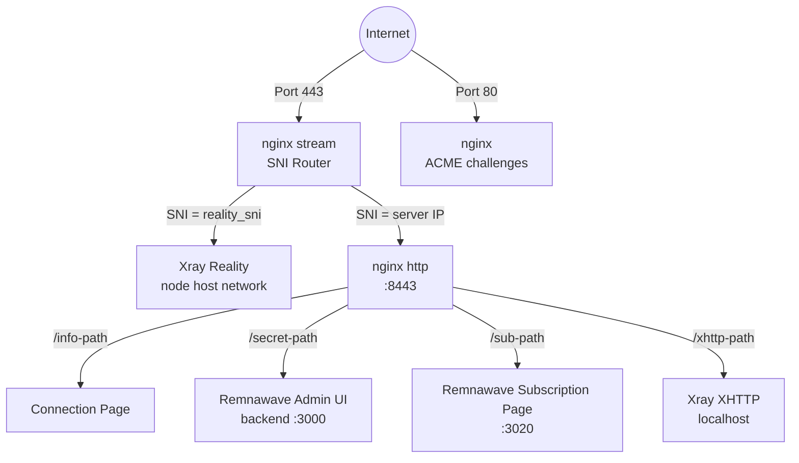
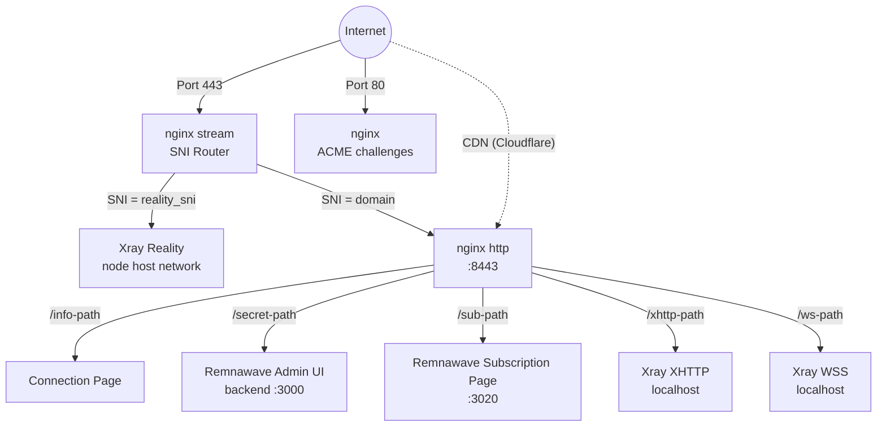
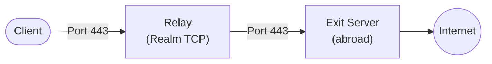

## پشته فناوری

- **VLESS+Reality** (Xray-core) — پروتکل پروکسی که خود را به عنوان یک وب‌سایت TLS معتبر جا می‌زند. سانسورچی‌هایی که سرور را بررسی می‌کند یک گواهی واقعی (مثلاً از microsoft.com) می‌بینند. فقط کلاینت‌هایی با کلید خصوصی صحیح می‌توانند متصل شوند.
- **Hysteria2** (Xray-core) — مسیر جایگزین UDP/443 برای شبکه‌های پرتلفات یا با تأخیر بالا. ترتیب اشتراک، انتقال‌های TCP را در اولویت نگه می‌دارد.
- **Remnawave** — پشته پنل مدرن برای Xray، به عنوان کانتینرهای جداگانه `remnawave/backend`، `remnawave/node` و `remnawave/subscription-page` مستقر شده. Backend یک REST API را نمایش می‌دهد (مدیریت شده با SDK رسمی `remnawave` Python)؛ نود Xray را در `network_mode: host` اجرا می‌کند؛ صفحه اشتراک URL‌های پیکربندی هر کاربر را ارائه می‌کند.
- **nginx** — وب‌سرور تک‌پردازشی که هم مسیریابی SNI و هم TLS را مدیریت می‌کند. ماژول stream روی پورت 443 گوش می‌دهد و ترافیک را بر اساس نام میزبان SNI بدون خاتمه دادن TLS مسیریابی می‌کند. ماژول http روی پورت 8443 TLS را خاتمه می‌دهد، صفحات اتصال را ارائه می‌دهد، UI مدیریت Remnawave + صفحه اشتراک را پروکسی معکوس می‌کند و ترافیق XHTTP/WSS را به Xray پروکسی می‌کند. گواهینامه‌ها توسط [acme.sh](https://github.com/acmesh-official/acme.sh) (Let's Encrypt) مدیریت می‌شوند.
- **Docker** — Remnawave backend + PostgreSQL + Valkey (میزبان پنل فقط)، نود Remnawave (هر نود خروجی) و صفحه اشتراک Remnawave (میزبان پنل، اختیاری) را اجرا می‌کند.
- **Provisioner خالص Python** — `src/meridian/provision/` مراحل استقرار را از طریق SSH اجرا می‌کند. هر مرحله `(conn, ctx)` دریافت و `StepResult` برمی‌گرداند. پروتکل `StepRenderer` در `progress.py` اجرای مرحله را از رندر Rich جدا می‌کند، `steps.py` را بدون واردات نمایشی نگه می‌دارد.
- **uTLS** — اثر انگشت TLS Client Hello Chrome را تقلید می‌کند و اتصالات را از ترافیق واقعی مرورگر غیرقابل تشخیص می‌سازد.

## توپولوژی سرویس

### حالت Standalone (بدون دامنه)

nginx stream TLS را خاتمه نمی‌دهد. آن نام میزبان SNI را از TLS Client Hello می‌خواند و جریان TCP خام را به backend مناسب منتقل می‌کند.

acme.sh گواهینامه IP Let's Encrypt را درخواست می‌کند (پروفایل shortlived 6 روزه، خودتجدید). اگر صدور گواهینامه IP پشتیبانی نشود، به self-signed بازمی‌گردد.

XHTTP روی پورت localhost-only اجرا می‌شود و توسط nginx پروکسی معکوس می‌شود — هیچ پورت خارجی اضافی نمایش داده نمی‌شود.

### حالت Domain

حالت دامنه VLESS+WSS را به‌عنوان مسیر fallback قدیمی CDN اضافه می‌کند. WSS برای سازگاری با استقرارهای Cloudflare CDN نگه داشته شده است؛ استقرارهای جدید باید XHTTP را به‌عنوان transport دوم ترجیح دهند. ترافیک WSS از طریق CDN Cloudflare عبور می‌کند و حتی در صورت مسدود شدن IP سرور نیز کار می‌کند.

### توپولوژی Relay

یک نود relay یک دستگاه ارسال TCP سطح ۴ سبک است که [Realm](https://github.com/zhboner/realm) را اجرا می‌کند. کلاینت به IP داخلی relay متصل می‌شود، که TCP خام را به سرور خروجی در خارج منتقل می‌کند. تمامی رمزنگاری انتها به انتها بین کلاینت و خروجی است — relay هرگز plaintext را نمی‌بیند.

جهت قرارداد core توانایی‌های به‌علاوه سیاست مسیریابی است. یک سرور واحد می‌تواند هم relay و هم توانایی خروجی داشته باشد؛ برای مثال، یک سرور منطقه‌ای RU می‌تواند entry relay و همچنین خروجی برای ترافیک RU-destination باشد.

## نحوه کار پروتکل Reality

1. سرور یک **keypair x25519** تولید می‌کند. کلید عمومی با کلاینت‌ها به اشتراک گذاشته می‌شود، کلید خصوصی روی سرور می‌ماند.
2. کلاینت روی پورت 443 اتصال برقرار می‌کند با TLS Client Hello که شامل دامنه تقلبی (مثلاً `www.microsoft.com`) به عنوان SNI است.
3. برای هر ناظر، این به نظر می‌رسد یک اتصال معمولی HTTPS به microsoft.com.
4. اگر یک **prober** Client Hello خود را ارسال کند، سرور اتصال را به microsoft.com واقعی proxy می‌کند — prober یک گواهینامه معتبر می‌بیند.
5. اگر کلاینت تأیید معتبر (مشتق شده از کلید x25519) را شامل شود، سرور تونل VLESS را برقرار می‌کند.
6. **uTLS** Client Hello را بایت برای بایت یکسان با Chrome می‌سازد، شکست TLS fingerprinting را شکست می‌دهد.

## ماژول Declarative state

Meridian هر جزئیات فلیت را در یک `cluster.yml` تک در `~/.meridian/cluster.yml` ذخیره می‌کند:

- **وضعیت واقعی** — `panel` (URL، توکن API، اعتبارات مدیر، secret_path، sub_path)، `nodes[]`، `relays[]`، `inbounds{}`، `branding` — پر شده توسط `meridian deploy`، `meridian node add` و غیره. کاربران به‌طور کلی این را دستی ویرایش نمی‌کند.
- **وضعیت مطلوب** — `desired_nodes[]`، `desired_relays[]`، `desired_clients[]`، `subscription_page` — اختیاری نوشته شده توسط اپراتور. `meridian plan` تفاوت Terraform-style را بین مطلوب و واقعی نشان می‌دهد؛ `meridian apply` همگرا می‌کند.

وضعیت Remnawave خود (کاربران، میزبان‌ها، پروفایل پیکربندی، internal squads) در پایگاه داده PostgreSQL روی میزبان پنل زندگی می‌کند. Meridian آن وضعیت را از طریق API REST رسمی با استفاده از SDK Python Remnawave pinned می‌خواند و می‌نویسد. پایگاه داده پنل منبع حقیقت برای کلاینت‌هاست؛ `cluster.yml` منبع حقیقت برای توپولوژی فلیت است.

## Meridian Studio و local Engine

Static Studio قرارداد تولید‌شده را مصرف می‌کند و می‌تواند فایل درخواست را بدون فرایند محلی بسازد. Executable Studio با `meridian studio` شروع می‌شود، FastAPI Engine را به `127.0.0.1` bind می‌کند و فقط endpoints تایپ شده باریک را برای کشف قرارداد، ریخته‌گری سرور ذخیره شده، تنظیمات سرور، تأیید SSH، bootstrap کلید با کمک رمز یکبار و dry-runs استقرار نمایش می‌دهد. SSH، filesystem، اسرار، عملیات و انصراف پشت Engine localhost باقی می‌ماند نه اجرا در مرورگر.

## طرح کانتینر Docker

**روی میزبان پنل** (اولین هدف `meridian deploy`):
- `remnawave` (backend) — NestJS API روی `127.0.0.1:3000`، پروکسی معکوس در `/<panel.secret_path>/`
- `remnawave-db` — PostgreSQL ذخیره کاربران، میزبان‌ها، inbounds
- `remnawave-redis` — Valkey cache (Redis-compatible fork؛ کانتینر نام ورثی `redis` برای سازگاری کتابخانه کلاینت)
- `remnawave-subscription-page` — frontend اشتراک، پورت داخلی کانتینر 3010، remapped به `127.0.0.1:3020` روی میزبان تا با API نود روی ماشین یکسان تصادم نشود؛ پروکسی معکوس در `/<subscription_page.path>/`
- `remnawave-node` — Xray runner در `network_mode: host` با `cap_add: NET_ADMIN` (مورد نیاز توسط panel 2.6.2+ برای plugins و IP Control)

**روی نودهای غیرپنل** (هر هدف `meridian node add`):
- فقط `remnawave-node` — ثبت شده در برابر API پنل از طریق کلید مخفی هر نود

تمام تصاویر پنل + اشتراک در `src/meridian/config.py` pinned و با SDK synclock نگه‌داشته می‌شود.

## سطح API پنل استفاده‌شده توسط Meridian

Meridian بیشتر با Remnawave از طریق SDK رسمی (`remnawave` v2.7.1) صحبت می‌کند. چند مسیر bootstrap و fallback — ثبت مدیر اولیه، ایجاد API-token و endpoints ابھی توسط SDK پوشش‌داده نشده — raw `httpx` بر مقابل URL پنل استفاده می‌کند. سطوح استفاده‌شده:

- **کاربران** — `create_user`، `get_user`، `delete_user`، `list_users`، `enable_user`، `disable_user` (CRUD کلاینت)
- **Hosts** — `create_host`، `list_hosts`، `enable_host`، `disable_host`، `delete_host` (endpoints هر inbound در URL‌های اشتراک)
- **Nodes** — `create_node`، `list_nodes`، `disable_node`، `delete_node`، `update_node_name` + bundle keygen مخفی / mTLS نود
- **Inbounds** — `list_inbounds`، `assign_inbounds_to_squad` (سیم inbound ↔ squad)
- **پروفایل‌های پیکربندی** — `create_config_profile`، `get_config_profile`، `update_xray_config` (دسترسی‌پذیر؛ استفاده‌شده توسط feature split-routing آینده)
- **Internal squads** — `list_internal_squads` (کاربران گروپ‌بندی شده برای دسترسی میزبان)

keypairs Reality x25519 از پنل واکشی نمی‌شوند — Meridian آن‌ها را سرور‌کنار روی نود با استفاده از باینری xray (`xray x25519`) تولید می‌کند و در `cluster.yml` مستقر می‌کند تا بازاستقرار را زندگی کند.

UI مدیریت توسط nginx در `/<panel.secret_path>/` روی پورت 443 در تمام حالت‌ها پروکسی معکوس می‌شود — تونل SSH نیازی نیست.

## Drift و plan / apply

هر زمان که مدیر وضعیت را مستقیماً در UI Remnawave ویرایش می‌کند (مثل اضافه کردن کاربر، تغییر نام میزبان)، بعدی `meridian plan` وضعیت واقعی را از پنل می‌خواند، در برابر وضعیت مطلوب (`cluster.yml`) مقایسه می‌کند و تفاوت را به عنوان اشیاء `PlanAction` تایپ شده صادر می‌کند. `meridian apply` آن‌ها را اجرا می‌کند، همان سطوح SDK را فراخوانی می‌کند؛ `meridian apply --json` نتایج اجرا تایپ شده هر اقدام را برای کلاینت‌های فرایند/UI برمی‌گرداند.

`meridian apply` وضعیت مطلوب را در `cluster.applied_state` (dataclass تایپ شده `AppliedState`) عکس می‌کند بعد از هر اجرای موفق. برنامه‌ریزی بعدی آن عکس را برای تمایز حذف‌های نیتمند (در last-applied بود) از drift (هرگز درخواست نشد) استفاده می‌کند. این رفتار state-tracking Terraform را منعکس می‌کند.

## الگوی پیکربندی nginx

Meridian مسیریابی stream را در `/etc/nginx/stream.d/meridian.conf` و مسیریابی HTTP را در `/etc/nginx/conf.d/meridian-http.conf` می‌نویسد. در صورت نیاز، یک بلوک include برای `stream` به `nginx.conf` اصلی افزوده می‌شود.

nginx مدیریت می‌کند:
- مسیریابی SNI روی پورت 443 (ماژول stream، بدون خاتمه TLS)
- خاتمه TLS روی پورت 8443 (ماژول http، گواهینامه‌ها توسط acme.sh مدیریت می‌شوند)
- پروکسی معکوس برای UI مدیریت Remnawave (`/<panel.secret_path>/` → `127.0.0.1:3000`)
- پروکسی معکوس برای صفحه اشتراک Remnawave (`/<subscription_page.path>/` → `127.0.0.1:3020`)
- ارائه صفحه اطلاعات اتصال (صفحات میزبانی‌شده با URL‌های قابل اشتراک)
- پروکسی معکوس برای ترافیق XHTTP به Xray (مسیریابی مبتنی بر مسیر، تمام حالت‌ها وقتی XHTTP فعال)
- پروکسی معکوس برای ترافیق WSS به Xray (حالت دامنه فقط)

## اختصاص پورت

| پورت | سرویس | دسترسی |
|------|---------|-------|
| 443/TCP | nginx stream (SNI router) | عمومی |
| 443/UDP | مسیر جایگزین Xray Hysteria2 | عمومی |
| 80 | nginx (ACME challenges) | عمومی |
| 8443 | nginx http (داخلی terminus) | داخلی |
| 3000 | Remnawave backend (UI مدیریت + API) | localhost |
| 3010 | Remnawave node API | host network |
| 3020 | صفحه اشتراک Remnawave | localhost |
| 10000-10999 | Xray Reality (per-node deterministic) | host network |
| 20000-29999 | Xray WSS (حالت دامنه، per-node) | host network |
| 30000-39999 | Xray XHTTP (per-node deterministic) | host network |
| 5432 | PostgreSQL (Remnawave DB) | شبکه داخلی Docker |

پورت‌های backend مربوط به XHTTP، WSS و Reality از شبکه میزبان استفاده می‌کنند، اما UFW دسترسی عمومی به آن‌ها را مسدود می‌کند. Hysteria2 مستقیماً روی UDP/443 عمومی گوش می‌دهد و nginx، TCP/443 عمومی را مدیریت می‌کند.

## خط لوله Provisioning

مراحل به‌ترتیب از طریق `build_setup_steps()` (میزبان پنل) یا `build_node_steps()` (node-only، استفاده‌شده برای redeploys و `meridian node add`) اجرا می‌شود. هر مرحله `(conn, ctx)` دریافت و `StepResult` برمی‌گرداند.

| # | مرحله | ماژول | هدف |
|---|------|--------|---------|
| 1 | CheckDiskSpace | `common.py` | Preflight |
| 2 | InstallPackages | `common.py` | بسته‌های OS (+fail2ban وقتی سخت‌سازی) |
| 3 | EnableAutoUpgrades | `common.py` | ارتقاهای بدون نظارت |
| 4 | SetTimezone | `common.py` | UTC |
| 5 | HardenSSH | `common.py` | احراز هویت فقط کلید (وقتی سخت‌سازی) |
| 6 | ConfigureFail2ban | `common.py` | jail brute-force sshd (وقتی سخت‌سازی) |
| 7 | ConfigureBBR | `common.py` | کنترل ازدحام TCP |
| 8 | ConfigureFirewall | `common.py` | UFW: 22 + 80 + 443 (وقتی سخت‌سازی) |
| 9 | InstallDocker | `docker.py` | Docker CE |
| 10 | DeployRemnawavePanel | `remnawave_panel.py` | Backend + PostgreSQL + Valkey + subscription-page |
| 11 | InstallWarp | `warp.py` | Cloudflare WARP (اختیاری) |
| 12 | InstallNginx | `nginx.py` | مسیریابی SNI + TLS + پروکسی معکوس |
| 13 | ConfigureNginx | `nginx.py` + `nginx_render.py` | پیکربندی nginx برای حالت IP یا دامنه |
| 14 | IssueTLSCert | `tls.py` | acme.sh + Let's Encrypt |
| 15 | DeployPWAAssets | `nginx.py` | تجهیزات صفحه اتصال PWA |

بعد از خط لوله provisioner، `configure_panel_and_node` در `panel_bootstrap.py` از REST API Remnawave برای ثبت inbounds، ایجاد کانتینر نود، اختصاص میزبان‌ها و ایجاد کلاینت پیش‌فرض استفاده می‌کند. استقرار کانتینر نود، ایجاد میزبان و کمک‌کننده‌های caching inbound در `node_deploy.py` زندگی می‌کند. کانتینر نود جزء خط لوله SSH نیست زیرا نیاز به کلید مخفی صادرشده توسط پنل دارد.

## Provisioning موازی

`meridian apply` می‌تواند نودهای مستقل را به‌طور همزمان از طریق `ThreadPoolExecutor` تجهیز کند (`--parallel N`، پیش‌فرض 4). هر کارگر SDK Remnawave خود را می‌گیرد؛ httpx client زیرین و per-thread asyncio event loop از طریق `threading.local()` جدا می‌شوند. `cluster.save()` توسط `RLock` محافظت می‌شود بنابراین عکس‌ها موازی به‌صورت تمیزی سریال می‌شوند.

## چرخه حیات اعتبار

1. **تولید**: اعتبارات تصادفی (رمز پنل، اسرار JWT، رمز PostgreSQL، کلید مخفی نود، keypairs Reality x25519 هر نود، UUID کلاینت)
2. **ذخیره محلی**: `~/.meridian/cluster.yml` — بلافاصله قبل از عملیات API/SSH ذخیره‌شده تا روی deploy سقوط فرایند را از سر شروع می‌توانید
3. **اعمال**: پنل + کانتینرهای نود بالا آمده، inbounds و میزبان‌ها از طریق REST API ایجاد شده
4. **تزامن**: پایگاه داده پنل Remnawave (Postgres) و `cluster.yml` هر دو wضعیت قانونی را نگه می‌داری؛ drift توسط `meridian plan` گزارش می‌شود
5. **اجرای دوباره**: کلیدهای Reality و UUID کلاینت‌ها در استقرار مجدد حفظ می‌شوند (پنل در صورت وجود آن‌ها اجازه تولید دوباره نمی‌دهد)
6. **بازیابی**: `meridian fleet recover --panel-url URL --api-token TOKEN` فایل `cluster.yml` را از API پنل زنده بازسازی می‌کند وقتی کپی محلی گم شود
7. **حذف**: `meridian teardown <IP>` تمام کانتینرهای Remnawave، پیکربندی nginx و ورودی `cluster.yml` پنل محلی (اختیاری تمام فایل) را متوقف و حذف می‌کند

## مکان فایل‌ها

### روی میزبان پنل
- `/opt/remnawave/` — فایل compose پنل + `.env` + `.env` صفحه اشتراک
- `/opt/remnawave/data/` — حجم داده PostgreSQL
- `/etc/nginx/stream.d/meridian.conf` — پیکربندی nginx stream (مسیریابی SNI)
- `/etc/nginx/conf.d/meridian-http.conf` — پیکربندی nginx http (TLS، پروکسی معکوس)
- `/etc/ssl/meridian/` — گواهینامه‌های TLS (مدیریت‌شده توسط acme.sh)

### روی هر نود
- `/opt/remnanode/` — فایل compose نود + `.env`

### روی ماشین محلی (deployer)
- `~/.meridian/cluster.yml` — وضعیت فلیت (اعتبارات پنل، نودها، relay‌ها، وضعیت مطلوب)
- `~/.meridian/cluster.yml.bak` — پشتیبان خودکار قبل از عملیات مخرب
- `~/.meridian/cache/` — کش throttle check به‌روزرسانی
- `~/.local/bin/meridian` — نقطه ورود CLI (نصب‌شده از طریق uv/pipx)
