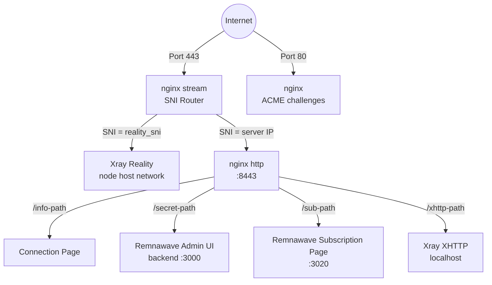
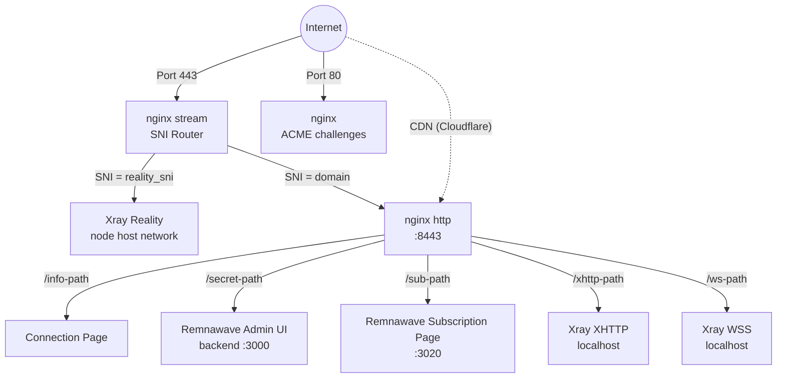
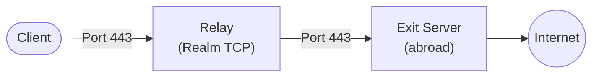

## Стек технологий

- **VLESS+Reality** (Xray-core) — прокси-протокол который маскируется под легитимный TLS-сайт. Цензоры проверяющие сервер видят реальный сертификат (например от microsoft.com). Подключиться могут только клиенты с правильным приватным ключом.
- **Hysteria2** (Xray-core) — резервный транспорт по UDP/443 для сетей с потерями или высокой задержкой. В подписках TCP-транспорты остаются первыми.
- **Remnawave** — современный стек панели для Xray развёрнутый как отдельные контейнеры Docker `remnawave/backend`, `remnawave/node` и `remnawave/subscription-page`. Backend выставляет REST API (управляется через официальный Python SDK `remnawave`); узел запускает Xray в `network_mode: host`; страница подписки обслуживает URL-конфигурации для каждого пользователя.
- **nginx** — однопроцессный веб-сервер обрабатывающий как SNI маршрутизацию так и TLS. Модуль stream слушает на порту 443 и маршрутизирует трафик по SNI имени хоста без завершения TLS. Модуль http на порту 8443 завершает TLS, обслуживает страницы подключения, обратно проксирует UI админа Remnawave + страницу подписки и проксирует трафик XHTTP/WSS к Xray. Сертификаты управляются [acme.sh](https://github.com/acmesh-official/acme.sh) (Let's Encrypt).
- **Docker** — запускает backend Remnawave + PostgreSQL + Valkey (хост панели только), узел Remnawave (каждый выходной узел) и страницу подписки Remnawave (хост панели, опционально).
- **Чистый Python provisioner** — `src/meridian/provision/` выполняет шаги развёртывания через SSH. Каждый шаг получает `(conn, ctx)` и возвращает `StepResult`. Протокол `StepRenderer` в `progress.py` разделяет выполнение шага от отрисовки Rich, держа `steps.py` свободным от импортов отображения.
- **uTLS** — имитирует отпечаток TLS Client Hello Chrome, делая соединения неотличимыми от реального браузерного трафика.

## Топология сервисов

### Автономный режим (без домена)

nginx stream **не** завершает TLS. Он читает имя хоста SNI из TLS Client Hello и пересылает необработанный TCP-поток на соответствующий бэкенд.

acme.sh запрашивает сертификат Let's Encrypt IP (6-дневный профиль с коротким сроком действия, автоматическое обновление). Отступает к самоподписанному если выпуск сертификата IP не поддерживается.

XHTTP работает на порту localhost и обратно проксируется nginx'ом — дополнительного внешнего порта не требуется.

### Режим домена

Режим домена добавляет VLESS+WSS как путь резерва CDN. Трафик проходит через CDN Cloudflare через WebSocket, позволяя соединению работать даже если IP-адрес сервера заблокирован.

### Топология ретранслятора

Узел ретранслятора это легковесный TCP маршрутизатор запускающий [Realm](https://github.com/zhboner/realm). Клиент подключается к внутреннему IP-адресу ретранслятора, который пересылает необработанный TCP на выходной сервер за границей. Всё шифрование осуществляется от конца до конца между клиентом и выходом — ретранслятор никогда не видит открытый текст.

Текущий CLI хранит узлы и ретрансляторы отдельно, но направление контракта ядра это возможности плюс политика маршрутизации. Один сервер может иметь как ретранслятор так и выходную возможность; например региональный RU сервер может быть записью ретранслятора и также выходом для RU-назначенного трафика.

## Как работает протокол Reality

1. Сервер генерирует **пару ключей x25519**. Открытый ключ делится с клиентами, приватный ключ остаётся на сервере.
2. Клиент подключается на порту 443 с TLS Client Hello содержащим домен маскировки (например `www.microsoft.com`) как SNI.
3. Для любого наблюдателя это выглядит как обычное HTTPS соединение с microsoft.com.
4. Если **зондировщик** отправляет свой собственный Client Hello, сервер проксирует соединение на реальный microsoft.com — зондировщик видит действительный сертификат.
5. Если клиент включает действительную аутентификацию (полученную из ключа x25519), сервер устанавливает туннель VLESS.
6. **uTLS** делает Client Hello идентичным Chrome в каждом байте, преодолевая TLS fingerprinting.

## Модель декларативного состояния

Meridian хранит каждый деталь флота в одном `cluster.yml` в `~/.meridian/cluster.yml`:

- **Фактическое состояние** — `panel` (URL, токен API, учётные данные админа, secret_path, sub_path), `nodes[]`, `relays[]`, `inbounds{}`, `branding` — заполняется `meridian deploy`, `meridian node add` и т.д. Пользователи обычно не редактируют это вручную.
- **Желаемое состояние** — `desired_nodes[]`, `desired_relays[]`, `desired_clients[]`, `subscription_page` — опционально написано оператором. `meridian plan` показывает различие в стиле Terraform между желаемым и фактическим; `meridian apply` приводит в соответствие.

Собственное состояние Remnawave (пользователи, хосты, конфигурационный профиль, внутренние squads) живёт в его базе данных PostgreSQL на хосте панели. Meridian читает и пишет то состояние через официальный REST API используя закреплённый Python SDK `remnawave`. База данных панели это источник истины для клиентов; `cluster.yml` это источник истины для топологии флота.

## Meridian Studio и локальный Engine

Статическая Studio потребляет сгенерированные контракты и может создавать файлы запросов без локального процесса. Исполняемая Studio запускается с помощью `meridian studio`, привязывает FastAPI Engine к `127.0.0.1` и выставляет только узкие типизированные конечные точки для открытия контрактов, чтения сохранённых серверов, установки сервера, валидации SSH, одноразовой пароль ассистенции при начальной загрузке ключей и пробных развёртываниях. SSH, файловая система, секреты, операции и отмена остаются позади того localhost Engine вместо запуска в браузере.

## Расположение Docker контейнеров

**На хосте панели** (первая цель `meridian deploy`):
- `remnawave` (backend) — NestJS API на `127.0.0.1:3000`, обратно проксируется в `/<panel.secret_path>/`
- `remnawave-db` — PostgreSQL хранящая пользователей, хостов, входящих
- `remnawave-redis` — Valkey кэш (Redis совместимый fork; контейнер держит имя наследия `redis` для совместимости библиотеки клиента)
- `remnawave-subscription-page` — фронтенд подписки, внутренний порт контейнера 3010, переназначено на `127.0.0.1:3020` на хосте чтобы избежать коллизии с API узла на этой же машине; обратно проксируется в `/<subscription_page.path>/`
- `remnawave-node` — Xray уже в `network_mode: host` с `cap_add: NET_ADMIN` (требуется панелью 2.6.2+ для плагинов и IP Control)

**На узлах не-панели** (каждая цель `meridian node add`):
- `remnawave-node` только — зарегистрирован против API панели через секретный ключ для узла

Все образы панели + подписки закреплены в `src/meridian/config.py` и содержатся в синхронизации с SDK.

## Поверхность API панели используемая Meridian

Meridian говорит с Remnawave в основном через официальный SDK (`remnawave` v2.7.1). Несколько путей начальной загрузки и отступления — первичная регистрация админа, создание токена API и конечные точки ещё не охваченные SDK — используют необработанный `httpx` против URL панели. Используемые поверхности:

- **Пользователи** — `create_user`, `get_user`, `delete_user`, `list_users`, `enable_user`, `disable_user` (CRUD клиента)
- **Хосты** — `create_host`, `list_hosts`, `enable_host`, `disable_host`, `delete_host` (конечные точки для входящих показываемые в URL подписки)
- **Узлы** — `create_node`, `list_nodes`, `disable_node`, `delete_node`, `update_node_name`, плюс набор для генерирования секрета узла / mTLS ключа
- **Входящие** — `list_inbounds`, `assign_inbounds_to_squad` (проводка входящих ↔ squad)
- **Конфигурационные профили** — `create_config_profile`, `get_config_profile`, `update_xray_config` (доступны; используются будущей особенностью раздельной маршрутизации)
- **Внутренние squads** — `list_internal_squads` (пользователи сгруппированные для видимости хоста)

Пары ключей Reality x25519 **не** получены из панели — Meridian генерирует их на стороне сервера на узле используя бинарник xray (`xray x25519`) и сохраняет в `cluster.yml` так чтобы они выжили переразворачивание.

UI админа обратно проксируется nginx'ом в `/<panel.secret_path>/` на порту 443 во всех режимах — SSH туннель не требуется.

## Дрейф и план / применение

Когда угодно администратор редактирует состояние непосредственно в UI Remnawave (например добавляет пользователя, переименовывает хост), следующий `meridian plan` читает фактическое состояние из панели, сравнивает его против желаемого состояния (`cluster.yml`) и выдаёт различие как типизированные объекты `PlanAction`. `meridian apply` выполняет их, вызывая те же поверхности SDK; `meridian apply --json` возвращает типизированные результаты выполнения для каждого действия для клиентов процесса/UI.

`meridian apply` делает снимок желаемого состояния в `cluster.applied_state` (типизированный dataclass `AppliedState`) после каждого успешного запуска. Следующий план использует этот снимок чтобы различать намеренные удаления (было в последнем применённом) от дрейфа (никогда не применялось). Это отражает поведение отслеживания состояния Terraform.

## Конфигурационный паттерн nginx

Meridian пишет stream-маршрутизацию в `/etc/nginx/stream.d/meridian.conf`, а HTTP-маршрутизацию — в `/etc/nginx/conf.d/meridian-http.conf`. При необходимости в основной `nginx.conf` добавляется один блок `stream` с include.

nginx обрабатывает:
- SNI маршрутизация на порту 443 (модуль stream, без завершения TLS)
- Завершение TLS на порту 8443 (модуль http, сертификаты управляются acme.sh)
- Обратный прокси для UI админа Remnawave (`/<panel.secret_path>/` → `127.0.0.1:3000`)
- Обратный прокси для страницы подписки Remnawave (`/<subscription_page.path>/` → `127.0.0.1:3020`)
- Обслуживание страницы информации подключения (размещённые страницы с URL для обмена)
- Обратный прокси для трафика XHTTP к Xray (маршрутизация по пути, все режимы когда XHTTP включён)
- Обратный прокси для трафика WSS к Xray (только режим домена)

## Назначение портов

| Порт | Сервис | Область |
|------|--------|--------|
| 443/TCP | nginx stream (SNI маршрутизатор) | Публичный |
| 443/UDP | Резервный транспорт Xray Hysteria2 | Публичный |
| 80 | nginx (ACME задачи) | Публичный |
| 8443 | nginx http (внутренний конец) | Внутренний |
| 3000 | Backend Remnawave (API админа + UI) | localhost |
| 3010 | API узла Remnawave | сеть хоста |
| 3020 | Страница подписки Remnawave | localhost |
| 10000-10999 | Xray Reality (по узлу детерминированный) | сеть хоста |
| 20000-29999 | Xray WSS (режим домена, по узлу) | сеть хоста |
| 30000-39999 | Xray XHTTP (по узлу детерминированный) | сеть хоста |
| 5432 | PostgreSQL (БД Remnawave) | внутренняя сеть Docker |

Backend-порты XHTTP, WSS и Reality используют сеть хоста, но UFW блокирует к ним доступ из интернета. Hysteria2 слушает публичный UDP/443, а nginx обрабатывает публичный TCP/443.

## Конвейер подготовки

Шаги выполняются последовательно через `build_setup_steps()` (хост панели) или `build_node_steps()` (только узел, используется для переразворачивания и `meridian node add`). Каждый шаг получает `(conn, ctx)` и возвращает `StepResult`.

| # | Шаг | Модуль | Назначение |
|---|-----|--------|-----------|
| 1 | CheckDiskSpace | `common.py` | Предварительная проверка |
| 2 | InstallPackages | `common.py` | Пакеты ОС (+fail2ban при защите) |
| 3 | EnableAutoUpgrades | `common.py` | Автоматические обновления |
| 4 | SetTimezone | `common.py` | UTC |
| 5 | HardenSSH | `common.py` | Аутентификация только по ключу (при защите) |
| 6 | ConfigureFail2ban | `common.py` | Тюрьма brute-force sshd (при защите) |
| 7 | ConfigureBBR | `common.py` | TCP управление перегруженностью |
| 8 | ConfigureFirewall | `common.py` | UFW: 22 + 80 + 443 (при защите) |
| 9 | InstallDocker | `docker.py` | Docker CE |
| 10 | DeployRemnawavePanel | `remnawave_panel.py` | Backend + PostgreSQL + Valkey + страница подписки |
| 11 | InstallWarp | `warp.py` | Cloudflare WARP (опционально) |
| 12 | InstallNginx | `nginx.py` | SNI маршрутизация + TLS + обратный прокси |
| 13 | ConfigureNginx | `nginx.py` + `nginx_render.py` | Конфигурация nginx для режима IP или домена |
| 14 | IssueTLSCert | `tls.py` | acme.sh + Let's Encrypt |
| 15 | DeployPWAAssets | `nginx.py` | Ресурсы PWA страницы подключения |

После конвейера provisioner, `configure_panel_and_node` в `panel_bootstrap.py` использует REST API Remnawave чтобы регистрировать входящие, создавать контейнер узла, назначать хосты и создавать клиента по умолчанию. Развёртывание контейнера узла, создание хоста и помощники кэширования входящих живут в `node_deploy.py`. Контейнер узла **не** часть конвейера SSH потому что требует секретный ключ выпущенный панелью.

## Параллельная подготовка

`meridian apply` может подготавливать независимые узлы параллельно через `ThreadPoolExecutor` (`--parallel N`, по умолчанию 4). Каждый рабочий получает свой собственный экземпляр `MeridianPanel` SDK; базовый клиент httpx и цикл событий per-thread asyncio изолированы через `threading.local()`. `cluster.save()` защищён `RLock` так чтобы параллельные снимки сериализовались чисто.

## Жизненный цикл учётных данных

1. **Генерация**: случайные учётные данные (пароль панели, JWT секреты, пароль PostgreSQL, секретный ключ узла, пара ключей Reality x25519 по узлу, UUID клиента)
2. **Сохранение локально**: `~/.meridian/cluster.yml` — сохраняется немедленно перед операциями API/SSH так чтобы упалое развёртывание могло возобновиться
3. **Применение**: контейнеры панели + узла подняты, входящие и хосты созданы через REST API
4. **Синхронизация**: база данных панели Remnawave (Postgres) и `cluster.yml` оба держат каноническое состояние; дрейф сообщается через `meridian plan`
5. **Переустановка**: ключи Reality и UUID клиента сохраняются через переразворачивание (панель отказывается регенерировать когда они существуют)
6. **Восстановление**: `meridian fleet recover --panel-url URL --api-token TOKEN` перестраивает `cluster.yml` из активного REST API панели когда локальная копия потеряна
7. **Удаление**: `meridian teardown <IP>` останавливает и удаляет все контейнеры Remnawave, конфигурацию nginx и запись `cluster.yml` панели (опционально весь файл)

## Расположение файлов

### На хосте панели
- `/opt/remnawave/` — файл compose панели + `.env` + `.env` страницы подписки
- `/opt/remnawave/data/` — том данных PostgreSQL
- `/etc/nginx/stream.d/meridian.conf` — конфигурация nginx stream (SNI маршрутизация)
- `/etc/nginx/conf.d/meridian-http.conf` — конфигурация nginx http (TLS, обратный прокси)
- `/etc/ssl/meridian/` — TLS сертификаты (управляются acme.sh)

### На каждом узле
- `/opt/remnanode/` — файл compose узла + `.env`

### На локальной машине (deployer)
- `~/.meridian/cluster.yml` — состояние флота (учётные данные панели, узлы, ретрансляторы, желаемое состояние)
- `~/.meridian/cluster.yml.bak` — автоматическая резервная копия перед деструктивными операциями
- `~/.meridian/cache/` — кэш проверки обновлений
- `~/.local/bin/meridian` — точка входа CLI (установлено через uv/pipx)
