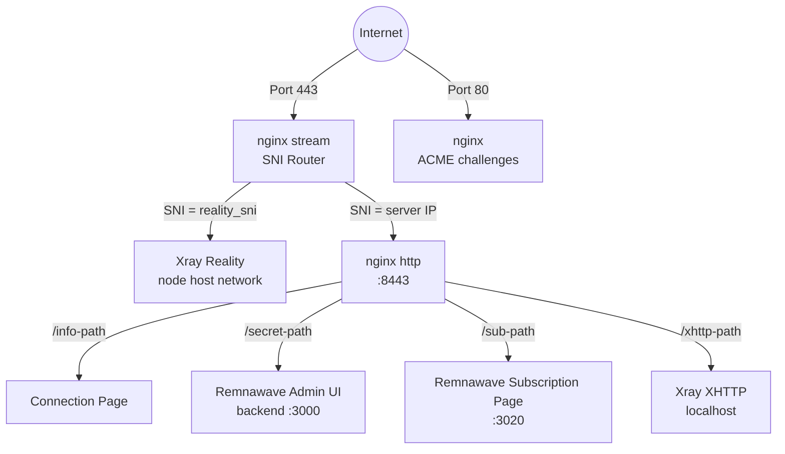
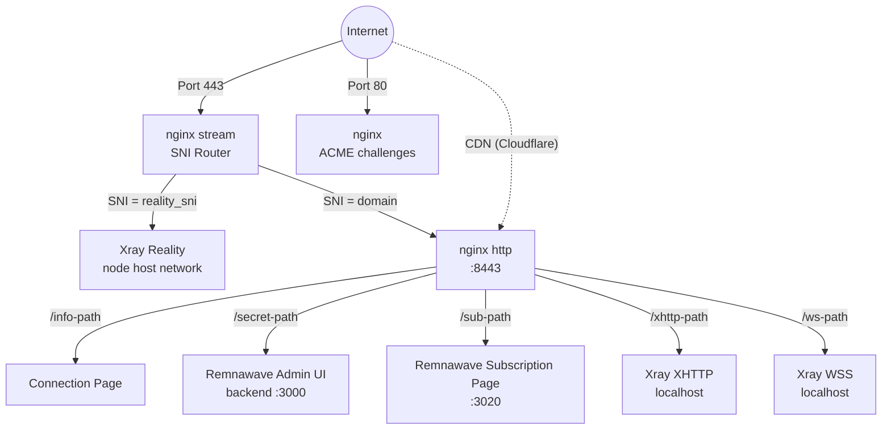
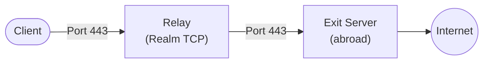

## 技术栈

- **VLESS+Reality**（Xray-core）— 伪装成合法 TLS 网站的代理协议。审查者探测服务器时会看到真实证书（例如来自 microsoft.com）。只有拥有正确私钥的客户端才能连接。
- **Hysteria2**（Xray-core）— 面向高丢包或高延迟网络的 UDP/443 回退传输。订阅排序仍优先使用 TCP 传输。
- **Remnawave** — Xray 现代面板堆栈，部署为单独的 `remnawave/backend`、`remnawave/node` 和 `remnawave/subscription-page` Docker 容器。后端公开 REST API（通过官方 `remnawave` Python SDK 管理）；节点在 `network_mode: host` 中运行 Xray；subscription-page 提供按用户配置 URL。
- **nginx** — 单进程 Web 服务器，同时处理 SNI 路由和 TLS。stream 模块监听端口 443 并根据 SNI 主机名路由流量，无需终止 TLS。http 模块在端口 8443 终止 TLS，提供连接页面、反向代理 Remnawave 管理 UI + subscription page，以及代理 XHTTP/WSS 流量到 Xray。证书由[acme.sh](https://github.com/acmesh-official/acme.sh)管理（Let's Encrypt）。
- **Docker** — 运行 Remnawave 后端 + PostgreSQL + Valkey（面板主机），Remnawave 节点（每个出口节点），以及 Remnawave subscription-page（面板主机，可选）。
- **纯 Python 配置器** — `src/meridian/provision/` 通过 SSH 执行部署步骤。每个步骤接收 `(conn, ctx)` 并返回 `StepResult`。`progress.py` 中的 `StepRenderer` 协议解耦步骤执行与 Rich 渲染，保持 `steps.py` 无显示导入。
- **uTLS** — 模拟 Chrome 的 TLS Client Hello 指纹，使连接与真实浏览器流量无法区分。

## 服务拓扑

### 独立模式（无域名）

nginx stream **不**终止 TLS。它从 TLS Client Hello 中读取 SNI 主机名，并将原始 TCP 流转发到相应的后端。

acme.sh 通过 ACME `shortlived` 配置文件从 Let's Encrypt 请求 IP 证书（有效期 6 天，自动续期）。如果不支持 IP 证书颁发，将回退到自签证书。

XHTTP 运行在仅限本地的端口上，由 nginx 反向代理 — 无需暴露额外的外部端口。

### 域名模式

域名模式添加 VLESS+WSS 作为旧版 CDN 回退路径。WSS 为兼容现有 Cloudflare CDN 部署而保留；新部署应优先使用 XHTTP 作为次要传输方式。流量通过 Cloudflare 的 CDN 经由 WebSocket 流动，即使服务器 IP 被阻断也能工作。

### 中继拓扑

中继节点是一个轻量级 TCP 转发器，运行[Realm](https://github.com/zhboner/realm)。客户端连接到中继的国内 IP，中继将原始 TCP 转发到国外的出口服务器。所有加密都是端到端的，在客户端和出口之间 — 中继永远看不到明文。

当前 CLI 分别存储节点和中继，但核心合约方向是能力加路由策略。单个服务器可以同时具有中继和出口能力；例如，一个区域 RU 服务器可以是 RU 目的地流量的中继入口和出口。

## Reality 协议如何工作

1. 服务器生成一个 **x25519 密钥对**。公钥与客户端共享，私钥保留在服务器上。
2. 客户端在端口 443 上连接，发送包含伪装域名（例如 `www.microsoft.com`）作为 SNI 的 TLS Client Hello。
3. 对于任何观察者来说，这看起来像一个到 microsoft.com 的正常 HTTPS 连接。
4. 如果一个**探针**发送自己的 Client Hello，服务器会将连接代理到真实的 microsoft.com — 探针看到一个有效的证书。
5. 如果客户端包含有效的身份验证（从 x25519 密钥派生），服务器建立 VLESS 隧道。
6. **uTLS** 使 Client Hello 逐字节与 Chrome 相同，击败 TLS 指纹识别。

## 声明性状态模型

Meridian 在单个 `cluster.yml` 中的 `~/.meridian/cluster.yml` 存储每个舰队详情：

- **实际状态** — `panel`（URL、API 令牌、管理凭证、secret_path、sub_path）、`nodes[]`、`relays[]`、`inbounds{}`、`branding` — 由 `meridian deploy`、`meridian node add` 等填充。用户通常不手动编辑这些。
- **所需状态** — `desired_nodes[]`、`desired_relays[]`、`desired_clients[]`、`subscription_page` — 由操作者可选写入。`meridian plan` 显示所需和实际之间的 Terraform 风格差异；`meridian apply` 收敛。

Remnawave 自己的状态（用户、主机、配置文件、内部小组）位于面板主机上的 PostgreSQL 数据库中。Meridian 通过官方 REST API 使用固定的 `remnawave` Python SDK 读写该状态。面板数据库是客户端的事实来源；`cluster.yml` 是舰队拓扑的事实来源。

## Meridian Studio 和本地 Engine

静态 Studio 消费生成的合约，无需本地进程可以构建请求文件。可执行 Studio 使用 `meridian studio` 启动，将 FastAPI Engine 绑定到 `127.0.0.1`，并仅公开狭窄的类型端点用于合约发现、已保存服务器读取、服务器设置、SSH 验证、一次性密码辅助密钥引导和部署干运行。SSH、文件系统、秘密、操作和取消保持在该 localhost Engine 后面，而不是在浏览器中运行。

## Docker 容器布局

**在面板主机上**（第一个 `meridian deploy` 目标）：
- `remnawave`（后端）— 在 `127.0.0.1:3000` 上的 NestJS API，在 `/<panel.secret_path>/` 反向代理
- `remnawave-db` — PostgreSQL 存储用户、主机、入站
- `remnawave-redis` — Valkey 缓存（Redis 兼容分叉；容器为客户端库兼容性保留遗留 `redis` 名称）
- `remnawave-subscription-page` — subscription 前端，容器内部端口 3010，在主机上重新映射到 `127.0.0.1:3020` 以避免与同一机器上的节点 API 冲突；在 `/<subscription_page.path>/` 反向代理
- `remnawave-node` — Xray 运行器在 `network_mode: host` 中带 `cap_add: NET_ADMIN`（面板 2.6.2+ 需要的插件和 IP 控制）

**在非面板节点上**（每个 `meridian node add` 目标）：
- 仅 `remnawave-node` — 针对面板的 API 注册，通过每个节点的秘密密钥

所有面板 + subscription 映像在 `src/meridian/config.py` 中固定并与 SDK 保持锁步。

## 面板 API 表面 Meridian 使用

Meridian 主要通过官方 SDK（`remnawave` v2.8.0）与 Remnawave 对话。一些引导和回退路径 — 初始管理员注册、API 令牌创建以及 SDK 尚未覆盖的端点 — 使用原始 `httpx` 针对面板 URL。使用的表面：

- **用户** — `create_user`、`get_user`、`delete_user`、`list_users`、`enable_user`、`disable_user`（客户端 CRUD）
- **主机** — `create_host`、`list_hosts`、`enable_host`、`disable_host`、`delete_host`（每个入站端点在订阅 URL 中显示）
- **节点** — `create_node`、`list_nodes`、`disable_node`、`delete_node`、`update_node_name`，加上节点秘密 / mTLS 密钥生成包
- **入站** — `list_inbounds`、`assign_inbounds_to_squad`（入站 ↔ 小组接线）
- **配置文件** — `create_config_profile`、`get_config_profile`、`update_xray_config`（可用；由未来分割路由特性使用）
- **内部小组** — `list_internal_squads`（用户按主机可见性分组）

Reality x25519 密钥对不从面板获取 — Meridian 在节点上使用 xray 二进制文件（`xray x25519`）服务器端生成它们，并将它们持久化在 `cluster.yml` 中，以便它们在重新部署中幸存下来。

管理 UI 由 nginx 反向代理在端口 443 上的 `/<panel.secret_path>/` — 所有模式中无需 SSH 隧道。

## 漂移和计划 / 应用

每当管理员直接在 Remnawave UI 中编辑状态（例如添加用户、重命名主机）时，下次 `meridian plan` 从面板读取实际状态，将其与所需状态（`cluster.yml`）比较，并发出类型化 `PlanAction` 对象的差异。`meridian apply` 执行它们，调用相同的 SDK 表面；`meridian apply --json` 为进程/UI 客户端返回类型化的每个操作执行结果。

`meridian apply` 在每次成功运行后将所需状态快照到 `cluster.applied_state`（类型化 `AppliedState` 数据类）。下次计划使用该快照来区分有意删除（在最后应用中）与漂移（从未应用）。这镜像 Terraform 的状态跟踪行为。

## nginx 配置模式

Meridian 将 stream 路由写入 `/etc/nginx/stream.d/meridian.conf`，将 HTTP 路由写入 `/etc/nginx/conf.d/meridian-http.conf`。如有需要，它会在主 `nginx.conf` 中追加一个 `stream` include 块。

nginx 处理：
- 端口 443 上的 SNI 路由（stream 模块，不终止 TLS）
- 端口 8443 上的 TLS 终止（http 模块，证书由 acme.sh 管理）
- Remnawave 管理 UI 的反向代理（`/<panel.secret_path>/` → `127.0.0.1:3000`）
- Remnawave subscription 页的反向代理（`/<subscription_page.path>/` → `127.0.0.1:3020`）
- 连接信息页提供（带有可共享 URL 的托管页面）
- XHTTP 流量到 Xray 的反向代理（基于路径的路由，启用 XHTTP 时在所有模式下）
- WSS 流量到 Xray 的反向代理（仅域名模式）

## 端口分配

| 端口 | 服务 | 范围 |
|------|---------|-------|
| 443/TCP | nginx stream（SNI 路由器） | 公开 |
| 443/UDP | Xray Hysteria2 回退 | 公开 |
| 80 | nginx（ACME 挑战） | 公开 |
| 8443 | nginx http（内部终点） | 内部 |
| 3000 | Remnawave 后端（管理 UI + API） | localhost |
| 3010 | Remnawave 节点 API | host network |
| 3020 | Remnawave subscription 页 | localhost |
| 10000-10999 | Xray Reality（每个节点确定性） | host network |
| 20000-29999 | Xray WSS（域名模式，每个节点） | host network |
| 30000-39999 | Xray XHTTP（每个节点确定性） | host network |
| 5432 | PostgreSQL（Remnawave 数据库） | 内部 Docker 网络 |

XHTTP、WSS 和 Reality 后端端口使用 host network，但 UFW 阻止公网访问。Hysteria2 直接监听公网 UDP/443，nginx 处理公网 TCP/443。

## 配置管道

步骤通过 `build_setup_steps()`（面板主机）或 `build_node_steps()`（仅节点，用于重新部署和 `meridian node add`）按顺序执行。每个步骤接收 `(conn, ctx)` 并返回 `StepResult`。

| # | 步骤 | 模块 | 目的 |
|---|------|--------|---------|
| 1 | CheckDiskSpace | `common.py` | 预检查 |
| 2 | InstallPackages | `common.py` | OS 包（加固时 +fail2ban） |
| 3 | EnableAutoUpgrades | `common.py` | 无人值守升级 |
| 4 | SetTimezone | `common.py` | UTC |
| 5 | HardenSSH | `common.py` | 仅密钥认证（加固时） |
| 6 | ConfigureFail2ban | `common.py` | sshd 暴力破解监狱（加固时） |
| 7 | ConfigureBBR | `common.py` | TCP 拥塞控制 |
| 8 | ConfigureFirewall | `common.py` | UFW: 22 + 80 + 443（加固时） |
| 9 | InstallDocker | `docker.py` | Docker CE |
| 10 | DeployRemnawavePanel | `remnawave_panel.py` | 后端 + PostgreSQL + Valkey + subscription-page |
| 11 | InstallWarp | `warp.py` | Cloudflare WARP（可选） |
| 12 | InstallNginx | `nginx.py` | SNI 路由 + TLS + 反向代理 |
| 13 | ConfigureNginx | `nginx.py` + `nginx_render.py` | IP 或域名模式的 nginx 配置 |
| 14 | IssueTLSCert | `tls.py` | acme.sh + Let's Encrypt |
| 15 | DeployPWAAssets | `nginx.py` | PWA 连接页资产 |

在配置管道之后，`panel_bootstrap.py` 中的 `configure_panel_and_node` 使用 Remnawave REST API 注册入站、创建节点容器、分配主机并创建默认客户端。节点容器部署、主机创建和入站缓存帮助者位于 `node_deploy.py`。节点容器不属于 SSH 管道的一部分，因为它需要面板颁发的秘密密钥。

## 并行配置

`meridian apply` 可以通过 `ThreadPoolExecutor`（`--parallel N`，默认 4）并发配置独立节点。每个工作线程获得自己的 `MeridianPanel` SDK 实例；基础 httpx 客户端和每个线程的 asyncio 事件循环通过 `threading.local()` 隔离。`cluster.save()` 受 `RLock` 保护，以便并行快照干净地序列化。

## 凭证生命周期

1. **生成**：随机凭证（面板密码、JWT 秘密、PostgreSQL 密码、节点秘密密钥、每个节点 Reality x25519 密钥对、客户端 UUID）
2. **本地保存**：`~/.meridian/cluster.yml` — 在 API/SSH 操作之前立即保存，以便崩溃的部署可以恢复
3. **应用**：面板 + 节点容器启动，通过 REST API 创建入站和主机
4. **同步**：Remnawave 面板数据库（Postgres）和 `cluster.yml` 都保有规范状态；漂移由 `meridian plan` 报告
5. **重新运行**：Reality 密钥和客户端 UUID 在重新部署中保留（当存在时面板拒绝重新生成）
6. **恢复**：`meridian fleet recover --panel-url URL --api-token TOKEN` 在本地副本丢失时从实时面板 API 重建 `cluster.yml`
7. **卸载**：`meridian teardown <IP>` 停止并删除所有 Remnawave 容器、nginx 配置和本地 `cluster.yml` 面板条目（可选整个文件）

## 文件位置

### 在面板主机上
- `/opt/remnawave/` — 面板 compose 文件 + `.env` + subscription 页 `.env`
- `/opt/remnawave/data/` — PostgreSQL 数据卷
- `/etc/nginx/stream.d/meridian.conf` — nginx stream 配置（SNI 路由）
- `/etc/nginx/conf.d/meridian-http.conf` — nginx http 配置（TLS、反向代理）
- `/etc/ssl/meridian/` — TLS 证书（由 acme.sh 管理）

### 在每个节点上
- `/opt/remnanode/` — 节点 compose 文件 + `.env`

### 在本地（部署者）机器上
- `~/.meridian/cluster.yml` — 舰队状态（面板凭证、节点、中继、所需状态）
- `~/.meridian/cluster.yml.bak` — 破坏性操作之前的自动备份
- `~/.meridian/cache/` — 更新检查限流缓存
- `~/.local/bin/meridian` — CLI 入口点（通过 uv/pipx 安装）
